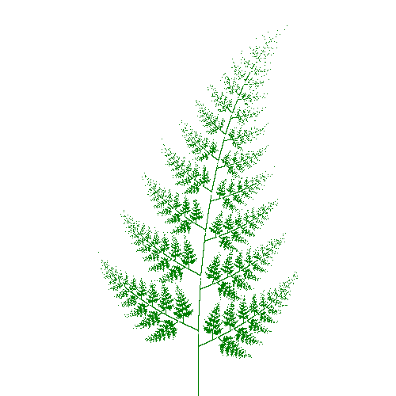

Fern-SML
===================




what is this
--------------------------------------

**shida** image generation by StandardML
*shida* means a *fern* in Japanese.

inspired by
id:nakamura001 2014/05/05
[shida generation by Processing](http://d.hatena.ne.jp/nakamura001/20140505/1399316565)


howto run
--------------------------------------

use [SML/NJ](http://www.smlnj.org/ "SML/NJ")

```sh
$ echo 'CM.make "sources.cm";' | sml
$ pnmtopng fern_nj.ppm > fern_nj.png
```

